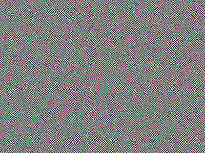
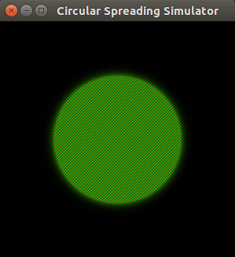

Spherical Propagation
=====================
_Spherical Propagation_ is a cellular automaton backed upon a
Cartesian discrete array of cells, that starts with a stimulus in the
center that propagates spherically rather than in a diamond-shaped
manner.

Concept
-------
This project dates back to 1985 / 1986.  At that time, I was
experimenting with cellular automata (though, at that time, I did not
even know the term “cellular automaton”).

Most cellular automata that propagate a stimulus of a particular cell
equally into all directions of an Cartesian discrete array of cells,
typically result in _diamond-shaped_ propagation of that stimulus.
Reason for this behavior is that the distance in terms of the minimum
of cells to cross to get to the stimulus' origin, results in such a
diamond shape (cp. Fig. 1).

```
       4
      434
     43234
    4321234
   432101234
    4321234
     43234
      434
       4
```
Fig. 1: Diamond-shaped Distances to the Center “0”

Actually, at that time, I already head read about wire routing
algorithms for printed circuit design that use this kind of
diamon-shaped propagation for finding the shortest path between two
pins.

However, my cellular automaton was intended for simulation of
real-world physics oriented purposes rather than finding paths on a
discrete array of cells, such that I expected a stimulus to propagate
in a _spherical_ rather than diamond-shaped manner.

Essentially, this task boils down to the problem that we have a
discrete Cartesian array of cells, but want the stimulus to propagate
such that it approximates a circle, whose shape is in the domain of a
real-valued space.  How can we bring these contradicting targets
together?

While at that time (~1985), I did not yet have had lectures on
infinitesimal calculus, I already had developed something much simpler
on my own, based on discrete mathematics.  Starting off with a series
of squares or cubes, I found basic computation rules similar to the
derivation rules in infinitesimal calculus, just by constructing delta
series, e.g.:

```
Δ⁰=x²:  0   1   4   9   16   25    36    49    64    …
Δ¹=2x:    1   3   5   7    9    11    13    15   …
Δ²=2:       2   2   2   2    2     2     2   …
```

thus effectively finding the rule δ(x^n) / δx = n * x^(n - 1), as
known well from infinitesimal calculus.  Similarly, I had a (vague)
idea of viewing cosine as a derivation of sine, and I knew the fact
that the shape of a circle can be constructed with sine and cosine,
p(ϕ) = (x(ϕ), y(ϕ)) = (sin(ϕ), cos(ϕ)), i.e. with sine and its
derivation.

Putting all these pieces together and experimenting a while, I soon
found the following cell update formula for the cellular automaton:

```
    cell.forceX = 0.25 *
      (neighbourSouth.forceX -
       neighbourNorth.forceX +
       neighbourWest.forceY -
       neighbourEast.forceY);
    cell.forceY = 0.25 *
      (neighbourSouth.forceY -
       neighbourNorth.forceY +
       neighbourWest.forceX -
       neighbourEast.forceX);
```

That's all.  In other words, for each cell, variable “forceX” is
averaged on the difference of the south and north neighbours' “forceX”
variables and on the difference of the west and east neighbours'
“forceY” variables, respectively, and vice-versa for the “forceY”
variable.  Also note some vague similarity to the Sobel operator.

Trivia
------
Just about the time of finding this automaton, there was a
Czechoslovak children's science fiction series on TV (“Návštěvníci”),
with an actor stressing the observation that even a square-cut stone
thrown into water will still result in spherical propagation.

Rewrite in 2007
---------------
Since I had lost my original implementation, in 2007, I rewrote the
cellular automaton.  While the finite number of cells is structured as
a discrete Cartesian array, the automaton still relies on real-valued
variables for storing the “forceX” and “forceY” values.  Experimenting
with various discrete representations for these variables, I found
that the precision of the circle that the propagation converges to,
heavily depends on the variable's floating point resolution: The lower
the resolution, the more the propagation decades to a diamond-like
shape.

Application in Arts
-------------------
As an unintended side-effect of these experiments, while trying to
visualize the propagation in some senseful manner, I accidentally got
a cyclic sequence of four pictures that give, when slowly played in a
loop, the illusion of a steady upwards movement, while all pixels
effectively stay fixed at their position (cp. Fig. 2).  Just in time
with the 2007 / 2008 financial crisis, I presented this loop sequence
of pictures, titled “Fortschrittsglaube” (“Believe in Progress”), on a
group exhibition in Poly Produzentengalerie e.V. as well as later on
the UND#4 exhibition.  You may vaguely recognize one or more crosses
in the picture, supporting the notion of a strong belief.



Fig. 2: “Fortschrittsglaube”, Cycle of Four Pictures Played as Infinite Loop

Install and run
---------------
The sources for the cellular automaton come with a small Ant build
script file for compiling and running.  Just envoke

```
  ant
```

to build all class files and a Jar file, and call

```
  ant run
```

to start the simulation, showing a slowly growing shape that
approximates towards a perfect circle.

Eventually, you should see a round shape emerging as depicted in the
screenshot below.



Fig. 3: Screenshot

To stop the program, just close the window that displays the slowly
growing shape.
